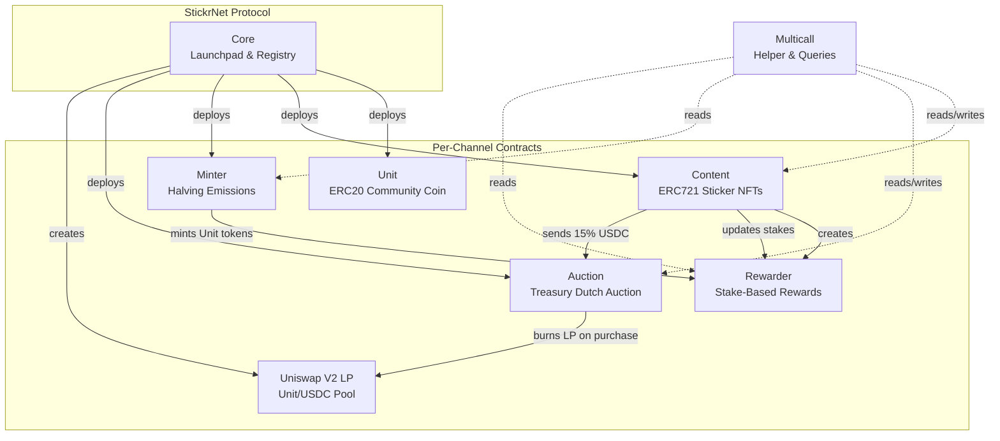
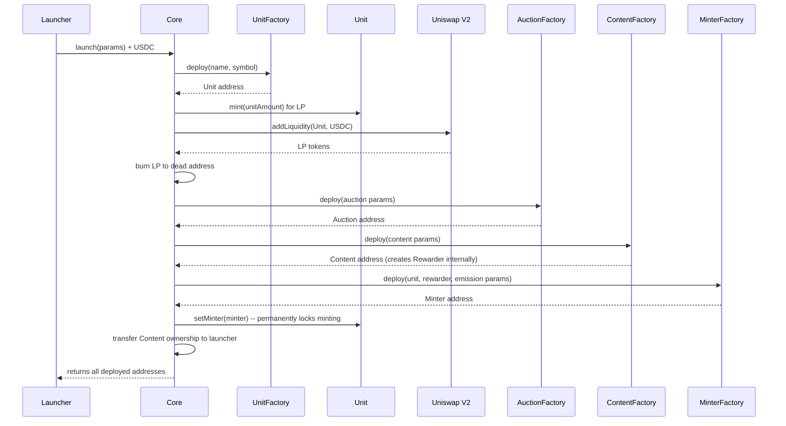
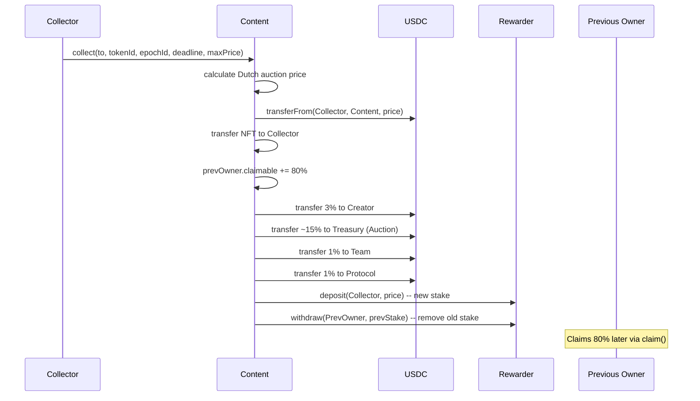
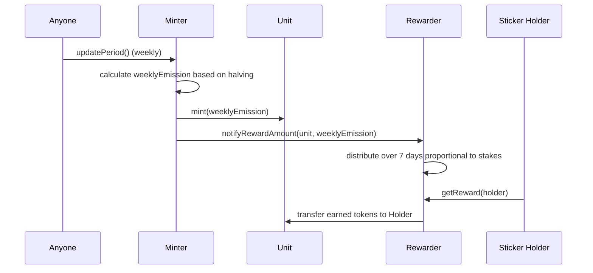

# StickrNet

A launchpad for onchain content communities. Each community gets its own coin and its own content stream. Creators post Stickers (content NFTs). Curators collect Stickers with USDC. Creators earn USDC when people collect their work. Curators mine the community coin by owning Stickers -- the more valuable the Sticker, the more you mine.

**Network**: [Base](https://base.org) (Chain ID 8453)

---

## Table of Contents

- [What is StickrNet?](#what-is-stickrnet)
- [How It Works](#how-it-works)
  - [Launching a Community](#launching-a-community)
  - [Stickers (Content NFTs)](#stickers-content-nfts)
  - [The Collection Mechanic](#the-collection-mechanic)
  - [Dutch Auction Pricing](#dutch-auction-pricing)
  - [Mining the Community Coin](#mining-the-community-coin)
  - [Fee Distribution](#fee-distribution)
  - [Treasury Auctions](#treasury-auctions)
  - [Bitcoin-Style Halving](#bitcoin-style-halving)
  - [Moderation](#moderation)
- [Why It Works This Way](#why-it-works-this-way)
- [Architecture](#architecture)
  - [System Overview](#system-overview)
  - [Contract Map](#contract-map)
  - [Launch Sequence](#launch-sequence)
  - [Collection Flow](#collection-flow)
  - [Reward Flow](#reward-flow)
- [Smart Contracts](#smart-contracts)
  - [Core.sol](#coresol)
  - [Content.sol](#contentsol)
  - [Unit.sol](#unitsol)
  - [Minter.sol](#mintersol)
  - [Rewarder.sol](#rewardersol)
  - [Auction.sol](#auctionsol)
  - [Multicall.sol](#multicallsol)
  - [Factory Contracts](#factory-contracts)
- [Monorepo Structure](#monorepo-structure)
- [Getting Started](#getting-started)
  - [Prerequisites](#prerequisites)
  - [Installation](#installation)
  - [Compile Contracts](#compile-contracts)
  - [Run Tests](#run-tests)
  - [Deploy](#deploy)
  - [Subgraph](#subgraph)
- [Deployed Addresses (Base)](#deployed-addresses-base)
- [Integration Guide](#integration-guide)
  - [Launching a Channel](#launching-a-channel)
  - [Creating a Sticker](#creating-a-sticker)
  - [Collecting a Sticker](#collecting-a-sticker)
  - [Claiming USDC Earnings](#claiming-usdc-earnings)
  - [Claiming Reward Tokens](#claiming-reward-tokens)
- [Security](#security)
- [License](#license)

---

## What is StickrNet?

StickrNet is a launchpad for **content engines** -- onchain communities that work like subreddits with built-in economics. Each community launched on StickrNet gets:

1. **A community coin** (Unit token) -- an ERC20 with governance-ready voting and a Bitcoin-style halving emission schedule
2. **A content stream** (Stickers) -- ERC721 NFTs that anyone can post and anyone can collect
3. **A treasury** -- funded by collection fees, auctioned off to coin holders
4. **Permanent liquidity** -- a Unit/USDC pool on Uniswap V2 with burned LP tokens

The outcome: a living community feed where the "best" posts surface because people pay USDC to own them and mine with them -- not because of likes or algorithms.

---

## How It Works

### Launching a Community

Anyone can launch a community (called a **Channel**) by providing USDC to the Core contract. The launch atomically:

1. Deploys a new Unit token (the community coin)
2. Mints initial Unit tokens and pairs them with the launcher's USDC to create a Uniswap V2 liquidity pool
3. Burns the LP tokens permanently (liquidity can never be removed)
4. Deploys a Content NFT collection (the Sticker stream)
5. Deploys a Rewarder (distributes Unit tokens to Sticker holders)
6. Deploys a Minter (produces new Unit tokens on a halving schedule)
7. Deploys an Auction (sells accumulated treasury fees)
8. Locks the Unit minting rights to the Minter permanently

The launcher becomes the owner of the Content contract and can configure moderation, team address, and metadata.

### Stickers (Content NFTs)

Each Sticker is a single post as an NFT -- one post, one owner. Stickers are priced in USDC. Anyone can create a Sticker by calling `create()` with a token URI pointing to the content metadata.

Key properties:
- **Standard ERC721 transfers are disabled.** The only way to change ownership is through collection.
- **Every Sticker is always collectible** at its current Dutch auction price.
- **The price you pay becomes your stake** in the Rewarder, determining your share of community coin mining.

### The Collection Mechanic

A Sticker can always be collected from the current owner at the current price. When collected:

```
Alice creates a Sticker (owns it, stake = 0)
        |
        v
Bob pays $40 USDC to collect it
  - Alice (previous owner) receives $32.00 (80%)
  - Creator (Alice) receives $1.20 (3%)
  - Treasury receives $5.80 (15%)
  - Team receives $0.40 (1%)
  - Protocol receives $0.40 (1%)
  - Bob now owns the Sticker, stake = $40
  - Bob starts mining the community coin
        |
        v
Charlie pays $70 USDC to collect it
  - Bob receives $56.00 (80%)
  - Creator (Alice) receives $2.10 (3%)
  - Treasury receives $10.50 (15%)
  - Team receives $0.70 (1%)
  - Protocol receives $0.70 (1%)
  - Charlie now owns the Sticker, stake = $70
  - Charlie mines more community coin than Bob did (higher stake)
```

Previous owners receive their 80% share via a **pull pattern** -- they call `claim()` to withdraw accumulated USDC, avoiding issues with addresses that can't receive direct transfers.

### Dutch Auction Pricing

Sticker prices follow a falling-price curve:

```
Price
  |
  |  $80 ████
  |           ████
  |               ████
  |                   ████
  |                       ████
  |                           ████ --> $0
  |__________________________________________ Time
       Collection          +1 day
```

**Mechanics:**

| Parameter | Value | Description |
|-----------|-------|-------------|
| `PRICE_MULTIPLIER` | 2x | After collection, the new starting price is 2x what was paid |
| `EPOCH_PERIOD` | 1 day | Price linearly decays from starting price to $0 over 1 day |

**Formula:**
```
currentPrice = initPrice - (initPrice * timeSinceCollection / EPOCH_PERIOD)
```

After a collection at price P:
- New starting price = 2 * P (clamped to `[minInitPrice, type(uint192).max]`)
- Price decays linearly to $0 over the next day
- If nobody collects within 1 day, the Sticker is free

**Why Dutch auctions?**
- **No sniping**: Being first means paying more, not less
- **Fair discovery**: Price settles at what someone is willing to pay
- **No bidding wars**: You just wait for your price
- **Always liquid**: Everything is always collectible, just a matter of price

### Mining the Community Coin

Owning Stickers is how you mine the community coin:

- **Your mining weight** = the USDC price you paid to collect the Sticker (your "stake")
- **Your share of emissions** = your total stake / total stakes across all Stickers
- **Higher-value Stickers mine more** -- if you own the Sticker people keep collecting at higher prices, you mine more

```
Example: PEPE community

Total stakes across all Stickers: $10,000
Your Sticker's stake (what you paid): $500
Your share: 5%

If 1,000 PEPE tokens are emitted this week:
  You earn: 50 PEPE
```

This is what makes curation meaningful -- curators aren't just browsing, they're choosing what to own because ownership produces the coin.

### Fee Distribution

When a Sticker is collected, the USDC payment is split:

| Recipient | Basis Points | Percentage | Description |
|-----------|-------------|------------|-------------|
| Previous Owner | 8,000 | 80% | Reward for holding the Sticker |
| Creator | 300 | 3% | Ongoing royalty to the original poster |
| Team | 100 | 1% | Channel launcher's team fee (can be disabled) |
| Protocol | 100 | 1% | StickrNet protocol fee (can be disabled) |
| Treasury | remainder | ~15% | Funds the treasury Auction, collects rounding dust |

If the team address is `address(0)`, the team fee flows to treasury. Same for the protocol fee address.

### Treasury Auctions

The 15% treasury cut accumulates as USDC in the Auction contract. Anyone can buy all accumulated treasury assets by paying with Unit/USDC LP tokens. The LP tokens used for payment are sent to the burn address -- permanently removing liquidity tokens from circulation.

The treasury auction also uses Dutch auction pricing:
- Price starts at a configurable multiplier of the last purchase price
- Decays linearly to $0 over the epoch period
- Multiplier range: 1.1x to 3x
- Epoch period range: 1 hour to 365 days

This creates a deflationary pressure on the Unit token: treasury USDC is bought with LP tokens that get burned, reducing the LP supply over time.

### Bitcoin-Style Halving

Each community's Unit token emissions follow a Bitcoin-like halving schedule:

```
                Emission Rate
                    |
initialUps -------->|████████████████
                    |                ████████████████
  initialUps/2 --->|                                ████████████████
                    |                                                ████████
  initialUps/4 --->|                                                        ████
                    |                                                            ███
       tailUps --->|................................................................████████████
                    |____________________________________________________________
                    0     halvingPeriod    2x            3x           4x      ...
```

**Parameters (per channel, set at launch):**

| Parameter | Description |
|-----------|-------------|
| `initialUps` | Starting emission rate (units per second) |
| `tailUps` | Minimum emission rate (never goes below this) |
| `halvingPeriod` | Time between halvings (minimum 7 days) |

**Formula:**
```
currentUps = initialUps >> halvings
halvings = (block.timestamp - startTime) / halvingPeriod

if currentUps < tailUps: currentUps = tailUps
```

Emissions are minted weekly. Anyone can call `updatePeriod()` once per week to trigger the mint. Minted tokens go directly to the Rewarder for distribution to Sticker holders.

### Moderation

Channels can operate in two modes:

**Unmoderated** (default): All Stickers are immediately collectible after creation.

**Moderated**: New Stickers require moderator approval before they can be collected. The channel owner can:
- Toggle moderation on/off with `setIsModerated()`
- Appoint/remove moderators with `setModerators()`
- Approve content directly as the owner

```
Moderated:   Creator --> Post Sticker --> [Pending] --> Moderator Approves --> [Collectible]
Unmoderated: Creator --> Post Sticker --> [Immediately Collectible]
```

---

## Why It Works This Way

**Why USDC for Sticker pricing?**
Creators earn cash when their work gets collected. No need to sell a volatile token -- you get paid in a stablecoin.

**Why disable standard NFT transfers?**
Collection is the only way to change ownership because the price paid determines your mining weight. Free transfers would break the stake-based reward system.

**Why Dutch auctions instead of fixed prices or English auctions?**
Dutch auctions guarantee everything is always collectible at some price. There's no scenario where a Sticker is stuck with an owner who won't sell. The price simply decays until someone collects.

**Why does the previous owner get 80%?**
To make holding Stickers attractive. If someone values the Sticker more than you, you get paid 80% of what they're willing to pay. The more the price goes up, the more you earn.

**Why burn LP tokens?**
Permanent liquidity. The initial liquidity pool can never be rug-pulled. As treasury auctions burn more LP tokens, the remaining LP tokens become more valuable.

**Why Bitcoin-style halving?**
Early participants earn more, creating urgency to join communities early. Tail emissions ensure rewards never fully stop, keeping the system running indefinitely.

**Why a Rewarder instead of direct token distribution?**
The Synthetix-style Rewarder achieves O(1) per-user reward calculation. No matter how many Sticker holders exist, reward accounting costs the same gas.

---

## Architecture

### System Overview



### Contract Map

| Contract | Role | Key Properties |
|----------|------|----------------|
| **Core** | Launchpad and registry | Deploys all channel contracts atomically, stores mappings |
| **Content** | ERC721 Sticker collection | Dutch auction collection, fee splitting, stake tracking, disabled transfers |
| **Unit** | ERC20 community coin | Permit + Votes (governance-ready), one-time minter lock |
| **Minter** | Emission controller | Bitcoin-style halving, weekly minting, anyone can trigger |
| **Rewarder** | Reward distributor | Synthetix-style, O(1) per-user, up to 10 reward tokens, 7-day periods |
| **Auction** | Treasury seller | Dutch auction for accumulated USDC, payment in LP tokens (burned) |
| **Multicall** | Convenience helper | Batched operations, auto-claiming, aggregated state queries |

### Launch Sequence



### Collection Flow



### Reward Flow



---

## Smart Contracts

### Core.sol

The central launchpad and registry. Deploys an entire channel ecosystem in a single transaction.

**Key state:**
```solidity
address public immutable quote;              // USDC address
address public immutable uniswapV2Factory;
address public immutable uniswapV2Router;

address public protocolFeeAddress;           // Receives 1% protocol fee
uint256 public minQuoteForLaunch;            // Minimum USDC to launch

mapping(address => address) public contentToUnit;
mapping(address => address) public contentToAuction;
mapping(address => address) public contentToMinter;
mapping(address => address) public contentToRewarder;
mapping(address => address) public contentToLP;
```

**Key functions:**
- `launch(LaunchParams)` -- Deploy a complete channel
- `setProtocolFeeAddress(address)` -- Update protocol fee recipient (owner only)
- `setMinQuoteForLaunch(uint256)` -- Update minimum launch cost (owner only)

### Content.sol

ERC721 NFT collection with the Dutch auction collection mechanic. Each token represents a Sticker.

**Constants:**
| Constant | Value | Description |
|----------|-------|-------------|
| `PREVIOUS_OWNER_FEE` | 8,000 (80%) | Share to previous owner |
| `CREATOR_FEE` | 300 (3%) | Share to content creator |
| `TEAM_FEE` | 100 (1%) | Share to team |
| `PROTOCOL_FEE` | 100 (1%) | Share to protocol |
| `EPOCH_PERIOD` | 1 day | Dutch auction decay period |
| `PRICE_MULTIPLIER` | 2e18 (2x) | Price reset multiplier |

**Key functions:**
```solidity
function create(address to, string memory tokenUri) external returns (uint256 tokenId);

function collect(
    address to,
    uint256 tokenId,
    uint256 epochId,      // Frontrun protection
    uint256 deadline,     // Transaction deadline
    uint256 maxPrice      // Slippage protection
) external returns (uint256 price);

function claim(address account) external;   // Withdraw accumulated USDC (pull pattern)
function getPrice(uint256 tokenId) public view returns (uint256);
```

**Disabled functions** (all revert with `Content__TransferDisabled`):
- `approve()`, `setApprovalForAll()`, `transferFrom()`, `safeTransferFrom()`

### Unit.sol

ERC20 token with ERC20Permit (gasless approvals) and ERC20Votes (governance). One is deployed per channel.

```solidity
function setMinter(address _minter) external;   // One-time, called by Core during launch
function mint(address account, uint256 amount) external;  // Only callable by minter
function burn(uint256 amount) external;          // Anyone can burn their own tokens
```

Once `setMinter()` transfers minting rights to the Minter contract (which has no `setMinter` function), minting becomes permanently locked to the halving schedule.

### Minter.sol

Bitcoin-style halving emission controller. Mints Unit tokens weekly and sends them to the Rewarder.

```solidity
uint256 public constant WEEK = 7 days;

function updatePeriod() external returns (uint256);  // Anyone can call, mints once per week
function weeklyEmission() public view returns (uint256);
function getUps() public view returns (uint256);     // Current units per second
```

**Halving calculation:**
```
halvings = (block.timestamp - startTime) / halvingPeriod
ups = initialUps >> halvings                          // Bitshift = divide by 2^halvings
if ups < tailUps: ups = tailUps                       // Floor at tail emission
```

### Rewarder.sol

Synthetix-style multi-reward distributor. Tracks stakes (set by Content contract) and distributes rewards proportionally.

```solidity
uint256 public constant DURATION = 7 days;       // Reward distribution period
uint256 public constant MAX_REWARD_TOKENS = 10;   // Max reward tokens per channel

function getReward(address account) external;     // Claim all pending rewards
function earned(address account, address token) public view returns (uint256);
function left(address token) public view returns (uint256);  // Remaining undistributed
```

**Reward math:**
```
rewardPerToken += (rewardRate * timeDelta * 1e18) / totalSupply
earned = balance * (rewardPerToken - userLastRewardPerToken) / 1e18 + storedRewards
```

Only the Content contract can call `deposit()` and `withdraw()` to update stakes.

### Auction.sol

Dutch auction for treasury assets. Forked from [Euler Fee Flow](https://github.com/euler-xyz/fee-flow).

```solidity
function buy(
    address[] calldata assets,     // Token addresses to claim
    address assetsReceiver,        // Where to send claimed assets
    uint256 _epochId,              // Frontrun protection
    uint256 deadline,              // Transaction deadline
    uint256 maxPaymentTokenAmount  // Slippage protection
) external returns (uint256 paymentAmount);

function getPrice() public view returns (uint256);
```

**Auction parameters (set at launch):**
| Parameter | Range | Description |
|-----------|-------|-------------|
| `epochPeriod` | 1 hour - 365 days | Duration of each Dutch auction |
| `priceMultiplier` | 1.1x - 3x | Starting price = last price * multiplier |
| `minInitPrice` | >= 1e6 | Floor price |
| `paymentToken` | LP token | What buyers pay with |
| `paymentReceiver` | `0x...dEaD` | LP tokens are burned |

### Multicall.sol

Convenience helper for batched operations and aggregated state queries. Handles auto-claiming for previous owners during collection and provides comprehensive read functions.

Key functions:
- `collect()` -- Collect a Sticker and auto-claim USDC for the previous owner
- `buy()` -- Purchase treasury assets via auction
- `launch()` -- Launch a channel through the Multicall
- `getContentState()` -- Get full state of a Content contract
- `getAuctionState()` -- Get full state of an Auction contract
- `getUnitState()` -- Get Unit token balances and supply
- `claimRewards()` -- Batch claim rewards from multiple channels

### Factory Contracts

Each core contract has a corresponding factory used by Core during `launch()`:

| Factory | Deploys |
|---------|---------|
| `UnitFactory` | Unit ERC20 tokens |
| `ContentFactory` | Content ERC721 collections |
| `MinterFactory` | Minter emission controllers |
| `RewarderFactory` | Rewarder distributors |
| `AuctionFactory` | Auction treasury sellers |

---

## Monorepo Structure

```
stickrnet-monorepo/
├── package.json                    # Yarn workspaces root
├── packages/
│   ├── hardhat/                    # Smart contracts package
│   │   ├── contracts/
│   │   │   ├── Core.sol            # Launchpad & registry
│   │   │   ├── Content.sol         # Sticker NFTs + collection
│   │   │   ├── Unit.sol            # Community coin (ERC20)
│   │   │   ├── Minter.sol          # Halving emissions
│   │   │   ├── Rewarder.sol        # Stake-based rewards
│   │   │   ├── Auction.sol         # Treasury Dutch auction
│   │   │   ├── Multicall.sol       # Batched helper
│   │   │   ├── UnitFactory.sol
│   │   │   ├── ContentFactory.sol
│   │   │   ├── MinterFactory.sol
│   │   │   ├── RewarderFactory.sol
│   │   │   ├── AuctionFactory.sol
│   │   │   ├── interfaces/         # Contract interfaces
│   │   │   └── mocks/              # Test mocks (MockUSDC, MockWETH, etc.)
│   │   ├── scripts/
│   │   │   └── deploy.js           # Deployment & verification script
│   │   ├── tests/                  # 284 passing tests
│   │   │   ├── testCore.js
│   │   │   ├── testContent.js
│   │   │   ├── testMinter.js
│   │   │   ├── testRewarder.js
│   │   │   ├── testMulticall.js
│   │   │   ├── testBoundary.js
│   │   │   ├── testExploits.js
│   │   │   ├── testExtreme.js
│   │   │   ├── testInvariants.js
│   │   │   ├── testSecurityAudit.js
│   │   │   └── testStress.js
│   │   ├── audits/                 # Security audit reports
│   │   └── hardhat.config.js
│   │
│   └── subgraph/                   # The Graph indexer
│       ├── schema.graphql          # Entity definitions
│       ├── subgraph.yaml           # Data source config
│       ├── src/
│       │   ├── core.ts             # Channel launch indexing
│       │   ├── content.ts          # Sticker creation/collection indexing
│       │   ├── rewarder.ts         # Reward tracking
│       │   ├── minter.ts           # Emission tracking
│       │   ├── pair.ts             # UniswapV2 price/volume/OHLCV
│       │   ├── constants.ts
│       │   └── helpers.ts
│       ├── abis/                   # Contract ABIs
│       └── docker-compose.yml      # Local Graph Node
```

---

## Getting Started

### Prerequisites

- [Node.js](https://nodejs.org/) v16+
- [Yarn](https://yarnpkg.com/) v1.22+
- [Git](https://git-scm.com/)

### Installation

```bash
git clone <repo-url>
cd stickrnet-monorepo
yarn install
```

### Compile Contracts

```bash
yarn hardhat compile
```

### Run Tests

```bash
# Run all tests (284 tests)
yarn hardhat test

# Run a specific test file
yarn hardhat test packages/hardhat/tests/testContent.js

# Run with gas reporting
REPORT_GAS=true yarn hardhat test

# Run with coverage
yarn hardhat coverage
```

### Deploy

1. Create a `.env` file in `packages/hardhat/`:

```env
PRIVATE_KEY=your_deployer_private_key
RPC_URL=https://mainnet.base.org
SCAN_API_KEY=your_basescan_api_key
```

2. Deploy to Base:

```bash
yarn hardhat deploy
```

The deploy script handles:
- Deploying all factory contracts and Core
- Deploying the Multicall helper
- Launching channels with configurable parameters
- Verifying all contracts on Basescan (including dynamically deployed channel contracts)

### Subgraph

**Build and deploy to The Graph Studio:**

```bash
# Generate types from schema and ABIs
yarn subgraph codegen

# Build the subgraph
yarn subgraph build

# Deploy to The Graph Studio
yarn subgraph deploy
```

**Run locally with Docker:**

```bash
cd packages/subgraph
docker compose up    # Starts graph-node, IPFS, PostgreSQL

# In another terminal
yarn subgraph create-local
yarn subgraph deploy-local
```

**Subgraph entities:**

| Entity | Description |
|--------|-------------|
| `Directory` | Global platform stats (channels, volume, revenue) |
| `Channel` | Per-community state, price data, reserves |
| `Account` | User accounts with transaction counts |
| `ChannelAccount` | Per-user per-channel participation data |
| `ContentPosition` | Individual Sticker state (owner, price, stake) |
| `Collect` | Immutable collection transaction history |
| `Swap` | UniswapV2 swap history per channel |
| `ChannelDayData` | Daily OHLCV candles + collection volume |
| `ChannelHourData` | Hourly OHLCV candles + collection volume |
| `ChannelMinuteData` | Minute-level OHLCV candles + collection volume |

---

## Deployed Addresses (Base)

| Contract | Address |
|----------|---------|
| Core | `0x7BBaFd368ceD20d6E54232AE95f0b76D1421af20` |
| Multicall | `0x82a67863CDc66C2Ee9360DB698AfD428BEA1B99e` |
| MockUSDC | `0xe90495BE187d434e23A9B1FeC0B6Ce039700870e` |

**External dependencies:**
| Contract | Address |
|----------|---------|
| Uniswap V2 Factory | `0x8909Dc15e40173Ff4699343b6eB8132c65e18eC6` |
| Uniswap V2 Router | `0x4752ba5DBc23f44D87826276BF6Fd6b1C372aD24` |

---

## Integration Guide

### Launching a Channel

```javascript
const { ethers } = require("ethers");

const core = new ethers.Contract(CORE_ADDRESS, coreAbi, signer);
const usdc = new ethers.Contract(USDC_ADDRESS, erc20Abi, signer);

// Approve USDC for the launch
const quoteAmount = ethers.utils.parseUnits("1000", 6); // 1000 USDC
await usdc.approve(CORE_ADDRESS, quoteAmount);

// Launch a channel
const tx = await core.launch({
  launcher: signer.address,
  tokenName: "Pepe Community",
  tokenSymbol: "PEPE",
  uri: "ipfs://QmChannelMetadata",
  quoteAmount: quoteAmount,
  unitAmount: ethers.utils.parseEther("1000000"),       // 1M Unit tokens for LP
  initialUps: ethers.utils.parseEther("1"),              // 1 UNIT/sec starting rate
  tailUps: ethers.utils.parseEther("0.001"),             // 0.001 UNIT/sec floor
  halvingPeriod: 30 * 24 * 60 * 60,                     // 30-day halvings
  contentMinInitPrice: ethers.utils.parseUnits("1", 6),  // $1 minimum Sticker price
  contentIsModerated: false,
  auctionInitPrice: ethers.utils.parseEther("1"),
  auctionEpochPeriod: 7 * 24 * 60 * 60,                 // 7-day auction epochs
  auctionPriceMultiplier: ethers.utils.parseEther("1.5"),
  auctionMinInitPrice: ethers.utils.parseUnits("1", 6),
});

const receipt = await tx.wait();
// Parse Core__Launched event for all deployed addresses
```

### Creating a Sticker

```javascript
const content = new ethers.Contract(CONTENT_ADDRESS, contentAbi, signer);

const tx = await content.create(
  signer.address,                    // Creator address
  "ipfs://QmStickerMetadataHash"     // Token URI
);
const receipt = await tx.wait();
const event = receipt.events.find(e => e.event === "Content__Created");
const tokenId = event.args.tokenId;
```

### Collecting a Sticker

```javascript
// Check current price
const price = await content.getPrice(tokenId);
const epochId = await content.idToEpochId(tokenId);

// Approve USDC
const usdc = new ethers.Contract(USDC_ADDRESS, erc20Abi, signer);
const maxPrice = price.mul(105).div(100); // 5% slippage buffer
await usdc.approve(CONTENT_ADDRESS, maxPrice);

// Collect
const deadline = Math.floor(Date.now() / 1000) + 300; // 5 min deadline
const tx = await content.collect(
  signer.address,  // Recipient
  tokenId,
  epochId,         // Frontrun protection
  deadline,
  maxPrice         // Slippage protection
);
await tx.wait();
```

### Claiming USDC Earnings

Previous owners accumulate USDC from the 80% fee. Claim it:

```javascript
// Check claimable amount
const claimable = await content.accountToClaimable(signer.address);
console.log(`Claimable: ${ethers.utils.formatUnits(claimable, 6)} USDC`);

// Claim
if (claimable.gt(0)) {
  await content.claim(signer.address);
}
```

### Claiming Reward Tokens

```javascript
const rewarder = new ethers.Contract(REWARDER_ADDRESS, rewarderAbi, signer);

// Check pending rewards
const earned = await rewarder.earned(signer.address, UNIT_ADDRESS);
console.log(`Earned: ${ethers.utils.formatEther(earned)} UNIT`);

// Claim all reward tokens at once
await rewarder.getReward(signer.address);
```

---

## Security

**Solidity version:** 0.8.19 (built-in overflow protection)

**Dependencies:** OpenZeppelin Contracts v4.8 (ERC20, ERC721, ReentrancyGuard, Ownable, SafeERC20)

**Audit results:** 0 Critical, 0 High, 0 Medium findings. Full audit reports in `packages/hardhat/audits/`.

**Security properties:**

| Category | Implementation |
|----------|---------------|
| **Reentrancy** | `nonReentrant` on all state-changing external functions |
| **Front-running** | `epochId` parameter prevents replay; `deadline` prevents stale txs; `maxPrice` limits slippage |
| **Access control** | `Ownable` on admin functions; `onlyContent` on Rewarder; one-time minter lock on Unit |
| **Safe transfers** | `SafeERC20` for all token transfers |
| **Price overflow** | `ABS_MAX_INIT_PRICE = type(uint192).max` caps price multiplier results |
| **Input validation** | Zero-address checks, empty-string checks, price bounds, epoch period bounds |

**Immutable after deployment:**
- Fee percentages (hardcoded constants)
- EPOCH_PERIOD, PRICE_MULTIPLIER (hardcoded constants)
- Rewarder, Unit, Quote, Core addresses (immutables)
- Unit minter (permanently locked to Minter contract)
- Initial LP (burned to dead address)

**Owner-configurable:**
- Treasury address, Team address
- Moderation mode and moderator list
- Metadata URI

**Explicitly not possible:**
- Standard ERC721 transfers (disabled, only `collect()` works)
- Minting Unit tokens outside of the Minter contract
- Withdrawing stakes directly from the Rewarder
- Removing initial liquidity (LP tokens burned)
- Changing fee percentages (hardcoded constants)

**Test suite:** 284 tests across 11 files covering core functionality, boundary conditions, exploit vectors, invariants, stress scenarios, and security audit cases.

---

## License

MIT
