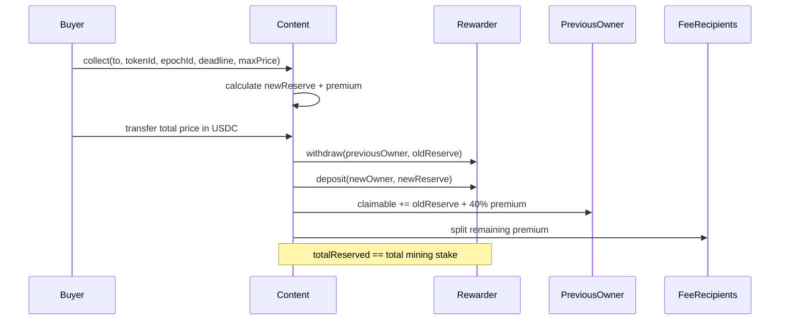

# StickrNet

StickrNet is a launchpad for onchain content communities on Base. Each Channel has a community coin, a stream of collectible Sticker NFTs, permanent Uniswap V2 liquidity, a fee treasury, and reserve-backed curation mining.

## Sticker economics

Every active, collected Sticker has a refundable USDC reserve. That reserve is the Sticker's mining power:

```text
mining power = refundable USDC reserve locked in Content
```

The collection price has two independent parts:

```text
collection price = next refundable reserve + current speculative premium
```

- A new Sticker starts with zero reserve.
- Its first collector funds a reserve equal to `minInitPrice`.
- Each later collector funds a reserve 10% larger than the current reserve.
- The speculative premium starts at the next reserve amount and decays linearly to zero over one day.
- The reserve does not decay. A Sticker can never be collected for less than the reserve the next owner must fund.

Example:

```text
Current reserve:          $100
Next reserve (1.10x):     $110
Current premium:           $50
Total collection price:   $160
New owner's mining power: $110
```

On collection, the outgoing owner recovers the complete old reserve. Only the premium is split:

| Recipient | Premium share |
|---|---:|
| Previous owner | 40% |
| Creator | 20% |
| Treasury | 30% plus rounding dust |
| Team | 5% |
| Protocol | 5% |

If the team or protocol address is zero, that disabled share goes to treasury. Every reserve refund and premium share uses pull accounting through `claim()`. The Multicall path attempts normal payouts automatically, but a blocked recipient cannot halt collection.

This makes wallet restrictions unnecessary. Self-collection is allowed, but the collector must still leave the entire new reserve locked to receive equal mining power.

## Refunds and surrender

The current owner may burn a collected Sticker with `surrender(tokenId)` after a 24-hour cooldown from its latest collection. Surrender:

1. Removes the Sticker's complete Rewarder balance.
2. Sets its reserve to zero.
3. Burns the NFT.
4. Returns the complete reserve to the owner.

A surrendered Sticker cannot continue mining.

## Solvency invariants

`Content.sol` separates refundable reserve liabilities from claimable sale proceeds. After every collection, claim, and surrender it enforces:

```text
Rewarder.totalSupply() == Content.totalReserved()
Content USDC balance >= Content.totalReserved() + Content.totalClaimable()
```

`claim()` can withdraw only `accountToClaimable`; it cannot consume refundable reserves.

Treasury Dutch auctions retain their configured LP-token price floor rather than decaying to zero. Reward streams are notifier-authorized and pause while no reserve weight is active, preventing schedule griefing and orphaned emissions.

## Protocol flow


```mermaid
sequenceDiagram
    participant Buyer
    participant Content
    participant Rewarder
    participant PreviousOwner
    participant FeeRecipients

    Buyer->>Content: collect(to, tokenId, epochId, deadline, maxPrice)
    Content->>Content: calculate newReserve + premium
    Buyer->>Content: transfer total price in USDC
    Content->>Rewarder: withdraw(previousOwner, oldReserve)
    Content->>Rewarder: deposit(newOwner, newReserve)
    Content->>PreviousOwner: claimable += oldReserve + 40% premium
    Content->>FeeRecipients: split remaining premium
    Note over Content,Rewarder: totalReserved == total mining stake
```

Standard ERC721 approvals and transfers remain disabled. Ownership changes only through `collect()` or is destroyed through `surrender()`.

## Contract views

`Content.sol` exposes:

```solidity
function reserveOf(uint256 tokenId) external view returns (uint256);
function premiumOf(uint256 tokenId) external view returns (uint256);
function nextReserveOf(uint256 tokenId) external view returns (uint256);
function getPrice(uint256 tokenId) external view returns (uint256);
function totalReserved() external view returns (uint256);
function totalClaimable() external view returns (uint256);
```

`Multicall.ContentState` exposes the current reserve, next reserve, premium, total price, and reward weight. `rewardWeight` always equals the current reserve.

## Repository

```text
packages/
  hardhat/   Solidity contracts, deployment scripts, tests, and audits
  app/       Next.js frontend
  subgraph/  The Graph schema and mappings
```

Install and validate:

```bash
npm install
cd packages/hardhat
npx hardhat compile
npx hardhat test

cd ../subgraph
npm run codegen
npm run build

cd ../app
npm run build
```

## Testnet deployment

The current deployment is testnet-only, so this model uses a clean cutover rather than migrating old Channel state. Deploy a fresh `ContentFactory`, `Core`, and `Multicall`, replace the app addresses, and reindex the subgraph from the new Core deployment block.

See [Reserve Economics Deployment](docs/RESERVE_ECONOMICS_MIGRATION.md) for the checklist.
